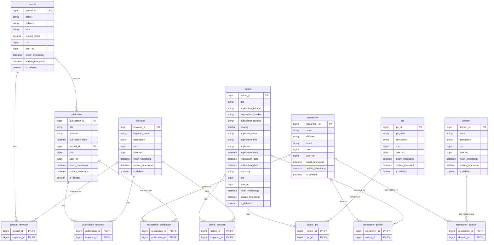

# Research Database ERD

## Entity Relationship Diagram

## 주요 엔티티 설명

### 핵심 엔티티
- **patent**: 특허 정보
- **publication**: 논문 정보  
- **researcher**: 연구자 정보
- **journal**: 저널 정보
- **keyword**: 키워드 정보
- **ipc**: IPC 분류 정보
- **domain**: 연구 분야 정보

### 관계 테이블
- **patent_ipc**: 특허와 IPC 분류 연결
- **patent_keyword**: 특허와 키워드 연결
- **journal_keyword**: 저널과 키워드 연결
- **publication_keyword**: 논문과 키워드 연결
- **researcher_patent**: 연구자와 특허 연결
- **researcher_domain**: 연구자와 연구분야 연결
- **researcher_publication**: 연구자와 논문 연결

### 공통 필드
모든 테이블에 다음 필드가 포함됩니다:
- `cno`: 회사 번호
- `user_no`: 사용자 번호
- `insert_timestamp`: 생성 시간
- `update_timestamp`: 수정 시간
- `is_deleted`: 삭제 여부 (소프트 삭제) 